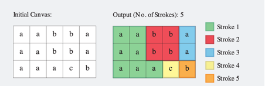
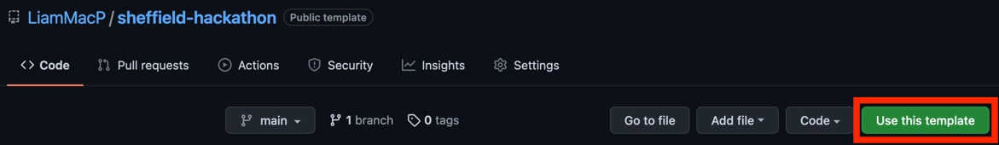
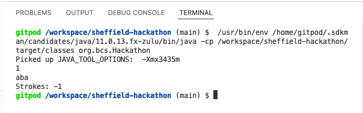

# BCS Sheffield Hackathon - Java Template (12/04)

## The Challenge

Digital graphics tools often make available a "bucket fill" tool that will only paint adjacent cells. In one fill, a modified bucket tool recolours adjacent cells (connected horizontally or vertically but not diagonally) that have the same colour. Given a picture represented as a 2-dimensional array of letters representing colours, find the minimum number of fills to completely repaint the picture.

### Constraints

* h and w refer to height and width of the graph.
* 1 ≤ h ≤ 10<sup>5</sup>
* 1 ≤ w ≤ 10<sup>5</sup>
* 1 ≤ h*w ≤ 10<sup>5</sup>
* length(picture[i]) = w (where 0 ≤ i < h)
* picture[i][j] is in the set  {'a', 'b', 'c'} (where 0 ≤ i < h and 0 ≤ j < w)

### Example

Each string represents a row of the picture and each letter represents a cell's colour. The diagram below shows the 5 fills needed to repaint the picture. It takes two fills each for a and b, and one for c. The input for the picture is shown below.

#### Input: 
```
3
aabba
aabba
aaacb
```



#### Output:

`5`

## Getting Started

1. Click to use the template repository.
   <br>
   

2. Open in Gitpod: Add `https://gitpod.io/#` in front of the url to your fork. E.g. if your repository is `https://github.com/LiamMacP/sheffield-hackathon` use `https://gitpod.io/#https://github.com/LiamMacP/sheffield-hackathon` to open in Gitpod.

   > On initial load Gitpod downloads the necessary plugins to support
   > developing of Java applications. To support running the test cases
   > it downloads a test runner. You may be presented with the following:
   > <br><br>
   > 
   > <br><br>
   > Click `Reload Window`, after which you should see the following tab:
   > <br><br>
   >  

3. It will ask you to continue with GitHub, sign in and authorize your GitHub account.

4. Open [Solution.java](./src/main/java/org/bcs/Solution.java) and start hacking! Enjoy!

## Testing Your Solution

There are 2 different ways of testing your solution.

1. Running against provided test cases
   <br><br>
   There are 8 provided test cases that can be run within Gitpod. Open [SolutionTest.java](src/test/java/org/bcs/SolutionTest.java) and click the green run button:
   <br><br>
   
   
   Another 5 will be run through the judging process.
2. Provide your own test case
   <br><br>
   1. Click the run button in the top right corner.
   2. In the terminal enter the amount of lines your picture has and press enter.
   3. Enter each line of the picture, followed by enter.
   4. The number of strokes will then be displayed.
   <br><br>
   

## Pushing Your Solution

When you have reached the end of the Hackathon - push your changes to your GitHub repository you created. 

If you get a permission denied error: 

1. Go to https://gitpod.io/integrations
2. Give your GitHub integration the `public_repo` permission.
3. Retry pushing

## Powered / Supported By

<a href="https://www.bcs.org/membership-and-registrations/member-communities/south-yorkshire-branch/"></a>
&emsp;
<a href="https://www.gitpod.io/"></a>

### Facilitators:

- Gareth Coleman, Maker, coder and educator, https://bitfixit.org.uk/
- Eva M. Barabas MBCS, Principal Engineer UK Home Office, Vice-chair - BCS South Yorkshire Committee, https://twitter.com/b_seven_e

### Mentors / Judges

- Neil Bizzell MBCS, Director of Education Developer Academy, https://www.linkedin.com/in/neilbizzell/
- Liam MacPherson MBCS, Senior Developer UK Home Office, https://www.linkedin.com/in/liammacpherson/
- Jeff Horton, Developer UK Home Office, https://twitter.com/KamiOfTea
- Aaron Robinson, Automation Developer UK Home Office, https://github.com/ARobinson26
